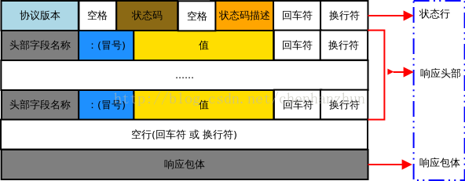

# 一、简介
## 1.1 AJAX简介
Ajax(Asynchronous JavaScript And XML)，就是异步的JS和XML

通过Ajax可以在浏览器中向服务器发送异步请求

**其最大的优势就是可以不刷新网页从而获取数据**

Ajax不是新的编程语言，而是一种将现有的标准组合在一起使用的新方式

## 1.2 XML简介
XML是一种可扩展的标记语言

XML被设计用来传输和存储数据

XML和HTML类似，不同的是，html中都是预定义标签，而xml中没有预定义标签，都是自定义标签。

**但是现在已经被JSON取代了**

## 1.3 AJAX特点
### 1.3.1 AJAX的优点
1. 可以无需刷新页面而与服务端进行通信
2. 允许你根据用户事件来更新部分页面问题

### 1.3.2 AJAX的缺点
1.  没有浏览历史，不能回退
2.  存在跨域问题（同源）
3.  SEO不友好，也就是搜索引擎优化，因为AJAX不能够被爬虫，网页源代码中找不到它，它是从服务器端的请求来的

## 1.4 http协议
http（hypertext transport protocol），超文本传输协议，协议详细规定了浏览器和万维网服务器之间的互相通信规则

### 1.4.1 请求报文
重点是格式与参数
```
行      POST /s?ie=ytf-8    HTTP/1.1
头      Host: guigu.com
        Cookie: name=guigu
        Content-Type: application/x-www-form-urlencoded
        User-Agent: chrome 83
空行
体      username=admin&password=admin
```

### 1.4.2 响应报文
```
行      HTTP/1.1 200 OK
头      Content-Type:text/html;charset=utff-8
        Content-length:2048
        Content-encoding:gzip
空行
体      html结构
```

### 1.4.3 查看请求报文和响应报文
f12 --> network --> Headers
Request Headers：请求头
Response Headers:响应头
Query String Parameters:查询字符串参数，对参数进行可视化，具体的可视化区域是utf-8区域的参数，也就是**请求行的内容**

f12 --> network --> Response:看具体的响应体

对于post请求，会通过Form Data来将用户名和密码传送给服务器

### 1.4.4 get/post
GET一般用于获取/查询资源信息，而POST一般用于更新资源信息.
#### 1.4.4.1 GET
当客户端要从服务器中读取文档时，当点击网页上的链接或者通过在浏览器的地址栏输入网址来浏览网页的，使用的都是GET方式。
GET方法要求服务器将URL定位的资源放在响应报文的数据部分，回送给客户端。

使用GET方法时，请求参数和对应的值附加在URL后面，利用一个问号(“?”)代表URL的结尾与请求参数的开始，传递参数长度受限制。
```html
例如，/index.jsp?id=100&op=bind,这样通过GET方式传递的参数直接表示在地址中
 
以用google搜索domety为例，Request报文如下：
 
GET /search?hl=zh-CN&source=hp&q=domety&aq=f&oq= HTTP/1.1
Accept: image/gif, image/x-xbitmap, image/jpeg, image/pjpeg, application/vnd.ms-excel, application/vnd.ms-powerpoint,
application/msword, application/x-silverlight, application/x-shockwave-flash, */*
Referer: <a href="http://www.google.cn/">http://www.google.cn/</a>
Accept-Language: zh-cn
Accept-Encoding: gzip, deflate
User-Agent: Mozilla/4.0 (compatible; MSIE 6.0; Windows NT 5.1; SV1; .NET CLR 2.0.50727; TheWorld)
Host: <a href="http://www.google.cn">www.google.cn</a>
Connection: Keep-Alive
Cookie: PREF=ID=80a06da87be9ae3c:U=f7167333e2c3b714:NW=1:TM=1261551909:LM=1261551917:S=ybYcq2wpfefs4V9g; NID=31=ojj8d-IygaEtSxLgaJmqSjVhCspkviJrB6omjamNrSm8lZhKy_yMfO2M4QMRKcH1g0iQv9u-2hfBW7bUFwVh7pGaRUb0RnHcJU37y-FxlRugatx63JLv7CWMD6UB_O_r
```
可以看到，GET方式的请求一般不包含”请求内容”部分，请求数据以地址的形式表现在请求行。地址链接如下：
`<a href="http://www.google.cn/search?hl=zh-CN&source=hp&q=domety&aq=f&oq=">http://www.google.cn/search?hl=zh-CN&source=hp&q=domety&aq=f&oq=</a> `

地址中”?”之后的部分就是**通过GET发送的请求数据**，在地址栏中可以看到，各个数据之间用”&”符号隔开。
**很显然，这种方式不适合传送私密数据。**
另外，由于不同的浏览器对地址的字符限制也有所不同，一般最多只能识别1024个字符，所以如果需要传送大量数据的时候，也不适合使用GET方式。

#### 1.4.4.2 POST
对于上面提到的不适合使用GET方式的情况，可以考虑使用POST方式，因为使用POST方法可以允许客户端给服务器提供信息较多。POST方法将请求参数封装在HTTP请求数据中，以名称/值的形式出现，可以传输大量数据，这样POST方式对传送的数据大小没有限制，而且也不会显示在URL中。还以上面的搜索domety为例，如果使用POST方式的话，格式如下：
```HTML
POST /search HTTP/1.1 
Accept: image/gif, image/x-xbitmap, image/jpeg, image/pjpeg, application/vnd.ms-excel, application/vnd.ms-powerpoint, 
application/msword, application/x-silverlight, application/x-shockwave-flash, */* 
Referer: <a href="http://www.google.cn/">http://www.google.cn/</a> 
Accept-Language: zh-cn 
Accept-Encoding: gzip, deflate 
User-Agent: Mozilla/4.0 (compatible; MSIE 6.0; Windows NT 5.1; SV1; .NET CLR 2.0.50727; TheWorld) 
Host: <a href="http://www.google.cn">www.google.cn</a> 
Connection: Keep-Alive 
Cookie: PREF=ID=80a06da87be9ae3c:U=f7167333e2c3b714:NW=1:TM=1261551909:LM=1261551917:S=ybYcq2wpfefs4V9g; NID=31=ojj8d-IygaEtSxLgaJmqSjVhCspkviJrB6omjamNrSm8lZhKy_yMfO2M4QMRKcH1g0iQv9u-2hfBW7bUFwVh7pGaRUb0RnHcJU37y-FxlRugatx63JLv7CWMD6UB_O_r
 
hl=zh-CN&source=hp&q=domety
```

可以看到，POST方式请求行中不包含数据字符串，这些数据保存在”请求内容”部分，各数据之间也是使用”&”符号隔开。
POST方式大多用于页面的表单中。因为POST也能完成GET的功能，因此多数人在设计表单的时候一律都使用POST方式，其实这是一个误区。
GET方式也有自己的特点和优势，我们应该根据不同的情况来选择是使用GET还是使用POST。

#### 1.4.4.3 HEAD
HEAD就像GET，只不过服务端接受到HEAD请求后只返回响应头，而不会发送响应内容。当我们只需要查看某个页面的状态的时候，使用HEAD是非常高效的，因为在传输的过程中省去了页面内容。

#### 1.4.4.4 get和post的区别

我们看看GET和POST的区别

1. GET提交的数据会放在URL之后，以?分割URL和传输数据，参数之间以&相连，如EditPosts.aspx?name=test1&id=123456. POST方法是把提交的数据放在HTTP包的Body中.

2. GET提交的数据大小有限制(因为浏览器对URL的长度有限制)，而POST方法提交的数据没有限制.

3. GET方式需要使用Request.QueryString来取得变量的值，而POST方式通过Request.Form来获取变量的值。

4. GET方式提交数据，会带来安全问题，比如一个登录页面，通过GET方式提交数据时，用户名和密码将出现在URL上，如果页面可以被缓存或者其他人可以访问这台机器，就可以从历史记录获得该用户的账号和密码.

**HTTP请求数据**

**HTTP响应数据**
