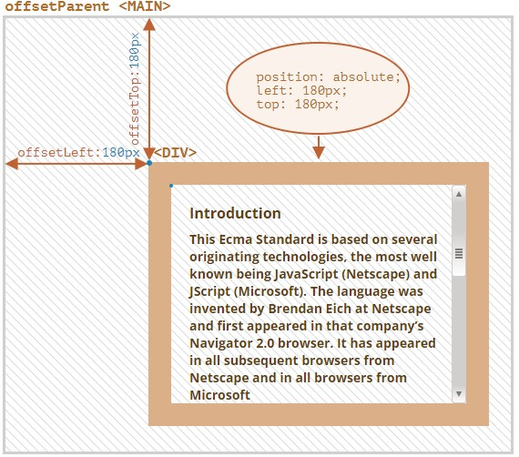

# 二、dom介绍 
## 2.1 dom 简介

DOM --> Document Object Model 文档对象模型
文档表示的就是整个的 HTML 网页文档
对象表示将网页中的每一个部分都转换成一个对象
模型表示对象之间的关系，从而方便获取对象
**通过 DOM 将所有页面内容表示为可以修改的对象。**

window 是**根对象**，首先，它是 JavaScript 代码的全局对象。其次，它代表“浏览器窗口”，并提供了控制它的方法。

```js
// 将背景颜色修改为红色
document.body.style.background = "red";
// 在 1 秒后将其修改回来
setTimeout(() => (document.body.style.background = ""), 1000);
```

节点(elem)是构成网页的最基本的组成部分，网页中的每一个部分都是一个节点
一共有12种节点类型，但是通常使用的只有4种;
1. `document`是页面的主要“入口点”。我们可以使用它来更改或创建页面上的任何内容。
1. **元素节点**:HTML 文档中的标签,`<html>`是根节点，`<head>`,`<body>`是其子项

1. **文本节点**:元素内的文本形成文本节点，一个文本节点只包含一个字符串。它没有子项，并且总是树的叶子。
**空格和换行符都是完全有效的字符，就像字母和数字。它们形成文本节点并成为 DOM 的一部分。**
由于历史原因,`<head>`之前的空格和换行符均被忽略。
如果我们在`</body>`之后放置一些东西，那么它会被自动移动到`body`内，并处于`body`中的最下方，因为HTML规范要求所有内容必须位于`<body>`内。
**所以`</body>`之后不能有空格。**
**字符串开头/结尾处的空格，以及只有空格的文本节点，通常会被工具隐藏**
与DOM一起使用的浏览器工具通常不会在文本的开始/结尾显示空格，并且在标签之间也不会显示空文本节点（换行符）。
1. **注释**

************************************************
**HTML中的所有内容，甚至注释，都会成为DOM的一部分。**
注释会被标记为 comment node
************************************************


事件：就是用户和浏览器之间的交互行为
比如点击按钮，鼠标移动，关闭窗口等

可以在事件对应的属性中设置 js 代码，当事件被触发时，代码会被执行
所以可以通过对对应事件来绑定处理函数从而响应事件，当事件被触发时，函数会被调用

```js
// 获取按钮对象
let btn = document.getElementById("btn");
// 绑定一个单击事件
btn.onclick = function () {
  alert("hello");
};
```

因为页面的加载是自上而下的，所以 script 标签如果想要运行，必须放到 body 里的标签的下面。
所以想要将 script 标签继续放在 head 里，则需要添加一个 onload 事件，从而使响应函数在页面加载完成之后再执行
这样可以保证代码执行时所有的 DOM 对象都已经加载完成了

```js
window.onload = function () {
  xxxx;
};
```

## 2.2 bom 简介

浏览器对象模型（Browser Object Model），简称 BOM，表示由浏览器（主机环境）提供的用于处理文档（document）之外的所有内容的其他对象。

例如：

- `navigator`对象提供了有关浏览器和操作系统的背景信息。navigator 有许多属性，但是最广为人知的两个属性是：`navigator.userAgent`—关于当前浏览器，`navigator.platform`—关于平台（可以帮助区分 Windows/Linux/Mac 等）。
- `location`对象允许我们读取当前`URL`，并且可以将浏览器重定向到新的`URL`。

```js
alert(location.href); // 显示当前 URL
if (confirm("Go to Wikipedia?")) {
  location.href = "https://wikipedia.org"; // 将浏览器重定向到另一个 URL
}
```

函数`alert/confirm/prompt`也是**BOM**的一部分：它们与文档（document）没有直接关系，但它代表了与用户通信的纯浏览器方法。

## 2.3 规范
**DOM 规范**
描述文档的结构、操作和事件，详见 [DOM规范](https://dom.spec.whatwg.org)。
CSSOM 规范
描述样式表和样式规则，对它们进行的操作，以及它们与文档的绑定，[CSSOM规范](https://www.w3.org/TR/cssom-1/)。
**HTML 规范**
描述 HTML 语言（例如标签）以及 BOM（浏览器对象模型）— 各种浏览器函数：setTimeout,alert,location等，详见[HTML规范](https://html.spec.whatwg.org)。它采用了 DOM 规范，并使用了许多其他属性和方法对其进行了扩展。
此外，某些类被分别描述在 [](https://spec.whatwg.org/)。

## 2.4 浏览器开发工具
开发者工具中的 DOM 结构是经过简化的。文本节点仅以文本形式显示。并且根本没有“空白”（只有空格）的文本节点。这其实挺好，因为大多数情况下，我们只关心元素节点。
点击左上角的 按钮可以让我们使用鼠标（或其他指针设备）从网页中选择一个节点并“检查（inspect）”它（在元素选项卡中滚动到该节点）。当我们有一个巨大的HTML页面（和相应的巨大 DOM），并希望查看其中的一个特定元素的位置时，这很有用。
另一种方法是在网页上右键单击，然后在上下文菜单中选择“检查（Inspect）”。

- **Styles** — 我们可以看到按规则应用于当前元素的CSS规则，包括内建规则（灰色）。几乎所有内容都可以就地编辑，包括下面的方框的dimension/margin/padding。
- **Computed** — 按属性查看应用于元素的 CSS：对于每个属性，我们可以都可以看到赋予它的规则（包括CSS继承等）。
- **Event Listeners** — 查看附加到 DOM 元素的事件侦听器。 

当然，在浏览器开发工具中，还能够通过与控制台交互来给页面中的元素添加一些js代码和命令。
`console.log(elem)` 显示元素的 DOM 树。
`console.dir(elem)` 将元素显示为 DOM 对象，非常适合探索其属性。
# 三、dom学习
## 3.1 dom的遍历
### 3.1.1 顶部节点
最顶层的树节点可以直接作为 document 的属性来使用：
`<html> = document.documentElement`
最顶层的document节点是`document.documentElement`。这是对应`<html>`标签的DOM节点。
`<body> = document.body` -`<body>`元素
`<head> = document.head` -`<head>`元素
脚本无法访问在运行时不存在的元素。
尤其是，如果一个脚本是在`<head>`中，那么脚本是访问不到`document.body`元素的，因为浏览器还没有读到它。
```js
<html>
<head>
  <script>
    alert( "From HEAD: " + document.body ); // null，这里目前还没有 <body>
  </script>
</head>
<body>
  <script>
    alert( "From BODY: " + document.body ); // HTMLBodyElement，现在存在了
  </script>
</body>
</html>
```

*******************
在 DOM 中，null 值就意味着“不存在”或者“没有这个节点”。
*******************

### 3.1.2 子节点
子节点 — 对应的是直系的子元素。换句话说，它们被完全嵌套在给定的元素中。例如，`<head>`和`<body>`就是`<html>`元素的子元素。
子孙元素 — 嵌套在给定元素中的所有元素，包括子元素，以及子元素的子元素等。

`childNodes`属性会获取包括文本节点在内的所有节点，包括**文字节点**
`firstChild`获取当前节点的第一个子节点
`lastChild`获取当前节点的最后一个子节点
```js
elem.childNodes[0] === elem.firstChild
elem.childNodes[elem.childNodes.length - 1] === elem.lastChild
```
这里还有一个特别的函数`elem.hasChildNodes()`用于检查节点是否有子节点。

`childNodes`看起来就像一个数组。但实际上它并不是一个数组，而是一个**集合**— 一个类数组的可迭代对象。
- 可以使用for...of来迭代
- 无法使用数组的方法，因为他不是一个数组
  如果我们想要使用数组的方法的话，我们可以使用`Array.from`方法来从集合创建一个“真”数组：

**DOM 集合是只读的**
**DOM 集合是实时的**
**不要使用 for..in 来遍历集合**
### 3.1.3 兄弟节点和父节点
**兄弟节点（Sibling）** 是指有同一个父节点的节点。
下一个兄弟节点在`nextSibling`属性中，上一个是在`previousSibling`属性中。
可以通过`parentNode`来访问父节点。
```js
// <body> 的父节点是 <html>
alert( document.body.parentNode === document.documentElement ); // true
// <head> 的后一个是 <body>
alert( document.head.nextSibling ); // HTMLBodyElement
// <body> 的前一个是 <head>
alert( document.body.previousSibling ); // HTMLHeadElement
```
### 3.1.4 纯元素导航
上面列出的导航（navigation）属性引用**所有**节点。例如，在**childNodes**中我们可以看到文本节点，元素节点，甚至包括注释节点（如果它们存在的话）。
但是对于很多任务来说，我们并不想要文本节点或注释节点。我们希望操纵的是代表标签的和形成页面结构的元素节点。
所以，让我们看看更多只考虑**元素节点**的导航链接（navigation link）
这些链接和我们在上面提到过的类似，只是在词中间加了 Element：
- `children` — 仅那些作为元素节点的子代的节点。
- `firstElementChild`，`lastElementChild` — 第一个和最后一个子元素。
- `previousElementSibling`，`nextElementSibling` — 兄弟元素。
- `parentElement` — 父元素。

parentElement 属性返回的是“元素类型”的父节点，而 parentNode 返回的是“任何类型”的父节点。这些属性通常来说是一样的：它们都是用于获取父节点。
唯一的例外就是 **document.documentElement**：
```js
alert( document.documentElement.parentNode ); // document
alert( document.documentElement.parentElement ); // null
```
### 3.1.5 表格
表格（Table）是一个很好的例子，它代表了一个特别重要的情况：

`<table>`元素支持(除了上面给出的，之外) 以下这些属性:
`table.rows` — `<tr>` 元素的集合。
`table.caption/tHead/tFoot` — 引用元素 `<caption>，<thead>，<tfoot>`。
`table.tBodies` — `<tbody>`元素的集合（根据标准还有很多元素，但是这里至少会有一个 — 即使没有被写在HTML源文件中，浏览器也会将其放入DOM中）。
`<thead>，<tfoot>，<tbody>` 元素提供了 rows 属性：
`tbody.rows` — 表格内部`<tr>`元素的集合。
`<tr>`：
`tr.cells` — 在给定 `<tr>` 中的 `<td>` 和 `<th>` 单元格的集合。
`tr.sectionRowIndex` — 给定的 `<tr>` 在封闭的 `<thead>/<tbody>/<tfoot>` 中的位置（索引）。
`tr.rowIndex` — 在整个表格中 `<tr>` 的编号（包括表格的所有行）。
`<td> 和 <th>`：
`td.cellIndex` — 在封闭的 `<tr>`中单元格的编号。
```html
<table id="table">
  <tr>
    <td>one</td><td>two</td>
  </tr>
  <tr>
    <td>three</td><td>four</td>
  </tr>
</table>
<script>
  // 获取带有 "two" 的 td（第一行，第二列）
  let td = table.rows[0].cells[1];
  td.style.backgroundColor = "red"; // highlight it
</script>
```

## 3.2 搜索
### 3.2.1 getElementsBy*
通过**document**对象调用获取元素节点
**只有`document.getElementById`，没有`anyElem.getElementById`**
getElementById()
   通过 id 属性获取一个元素节点对象
   getElementById方法只能被在document对象上调用。它会在整个文档中查找给定的id。


1. document.getElementsByTagName()
   通过标签名获取一组元素节点对象
   这个会返回一个类数组对象，会将所有返回的内容封装到一个对象中，即使其只有一个
2. document.getElementsByName()
   通过 name 属性获取一组元素节点对象

`elem.getElementsByClassName(className)`返回具有给定CSS类的元素。

所有的 "getElementsBy*" 方法都会返回一个 **实时的（live）** 集合。这样的集合始终反映的是文档的当前状态，并且在文档发生更改时会“自动更新”。
相反，querySelectorAll 返回的是一个 **静态的** 集合。就像元素的固定数组。
### 3.2.2 elem.querySelector*
最常用的方法：
`elem.querySelectorAll(css)`返回**elem**中与给定**CSS**选择器匹配的所有元素。
在这里，我们查找所有为最后一个子元素的`<li>`元素：
```html
<ul>
  <li>The</li>
  <li>test</li>
</ul>
<ul>
  <li>has</li>
  <li>passed</li>
</ul>
<script>
  let elements = document.querySelectorAll('ul > li:last-child');
  for (let elem of elements) {
    alert(elem.innerHTML); // "test", "passed"
  }
</script>
```
CSS选择器的伪类，例如 :hover 和 :active 也都是被支持的。例如，`document.querySelectorAll(':hover')` 将会返回鼠标指针正处于其上方的元素的集合（按嵌套顺序：从最外层 `<html>` 到嵌套最多的元素）。

`elem.querySelector(css)`调用会返回给定CSS选择器的**第一个**元素。
换句话说，结果与`elem.querySelectorAll(css)[0]`相同，但是后者会查找**所有**元素，并从中选取一个，而`elem.querySelector`只会查找一个。因此它在速度上更快，并且写起来更短。

### 3.2.3 matches
`elem.matches(css)`不会查找任何内容，它只会检查 elem 是否与给定的 CSS 选择器匹配。它返回 true 或 false。

当我们遍历元素（例如数组或其他内容）并试图过滤那些我们感兴趣的元素时，这个方法会很有用。
```html
<a href="http://example.com/file.zip">...</a>
<a href="http://ya.ru">...</a>
<script>
  // 不一定是 document.body.children，还可以是任何集合
  for (let elem of document.body.children) {
    // $=是以xxx结尾的意思，这里的意思是以zip结尾
    if (elem.matches('a[href$="zip"]')) {
      alert("The archive reference: " + elem.href );
    }
  }
</script>
```

### 3.2.4 closest
元素的祖先（ancestor）是：父级，父级的父级，它的父级等。祖先们一起组成了从元素到顶端的父级链。
`elem.closest(css)`方法会查找与 CSS 选择器匹配的最近的祖先。elem 自己也会被搜索。
换句话说，方法`closest`在元素中得到了提升，并检查每个父级。如果它与选择器匹配，则停止搜索并返回该祖先。
```html
<h1>Contents</h1>

<div class="contents">
  <ul class="book">
    <li class="chapter">Chapter 1</li>
    <li class="chapter">Chapter 1</li>
  </ul>
</div>

<script>
  let chapter = document.querySelector('.chapter'); // LI

  alert(chapter.closest('.book')); // UL
  alert(chapter.closest('.contents')); // DIV

  alert(chapter.closest('h1')); // null（因为 h1 不是祖先）
</script>
```

### 3.2.5 总结
方法名 | 搜索方式	| 可以在元素上调用？|	实时的？
-|-|-|-|
querySelector|	CSS-selector|	✔	|-
querySelectorAll|	CSS-selector|	✔|	-
getElementById	|id	|-|	-
getElementsByName|	name|	-|	✔
getElementsByTagName|	tag or '*'|	✔|	✔
getElementsByClassName	|class|	✔	|✔


用来检查子级与父级之间关系的方法：
如果 elemB 在 elemA 内（elemA 的后代）或者 elemA==elemB，elemA.contains(elemB) 将返回 true。

## 3.3 节点属性
- EventTarget — 是根的“抽象（abstract）”类。该类的对象从未被创建。它作为一个基础，以便让所有 DOM 节点都支持所谓的“事件（event）”。
- Node — 也是一个“抽象”类，充当 DOM 节点的基础。它提供了树的核心功能：parentNode，nextSibling，childNodes 等（它们都是 getter）。Node 类的对象从未被创建。但是有一些继承自它的具体的节点类，例如：文本节点的 Text，元素节点的 Element，以及更多异域（exotic）类，例如注释节点的 Comment。
- Element — 是 DOM 元素的基本类。它提供了元素级的导航（navigation），例如 nextElementSibling，children，以及像 getElementsByTagName 和 querySelector 这样的搜索方法。浏览器中不仅有 HTML，还会有 XML 和 SVG。Element 类充当更多特定类的基本类：SVGElement，XMLElement 和 HTMLElement。
- HTMLElement — 最终是所有 HTML 元素的基本类。各种 HTML 元素均继承自它：
  - HTMLInputElement — `<input>` 元素的类，
  - HTMLBodyElement —`<body>` 元素的类，
  - HTMLAnchorElement — `<a>` 元素的类，

还有很多其他标签具有自己的类，可能还具有特定的属性和方法，而一些元素，如 `<span>、<section>、<article>` 等，没有任何特定的属性，所以它们是 HTMLElement 类的实例。

**给定节点的全部属性和方法都是继承的结果。**

- HTMLInputElement — 该类提供特定于输入的属性，
- HTMLElement — 它提供了通用（common）的 HTML 元素方法（以及 getter 和 setter）
- Element — 提供通用（generic）元素方法，
- Node — 提供通用 DOM 节点属性，
- EventTarget — 为事件（包括事件本身）提供支持，
- ……最后，它继承自 Object，因为像 hasOwnProperty 这样的“普通对象”方法也是可用的。

可以通过回调来查看 DOM 节点类名,**constructor.name** 就是它的名称
`alert( document.body.constructor.name ); // HTMLBodyElement`
或者可以使用**toString**方法
可以使用 **instanceof** 来检查继承：

在规范中，DOM 类不是使用 JavaScript 来描述的，而是一种特殊的 **接口描述语言**（Interface description language），简写为 **IDL**，它通常很容易理解。
在 IDL 中，所有属性以其类型开头。例如，DOMString 和 boolean 等。
```js
// 定义 HTMLInputElement
// 冒号 ":" 表示 HTMLInputElement 继承自 HTMLElement
interface HTMLInputElement: HTMLElement {
  // 接下来是 <input> 元素的属性和方法

  // "DOMString" 表示属性的值是字符串
  attribute DOMString accept;
  attribute DOMString alt;
  attribute DOMString autocomplete;
  attribute DOMString value;

  // 布尔值属性（true/false）
  attribute boolean autofocus;
  ...
  // 现在方法："void" 表示方法没有返回值
  void select();
  ...
}
```

### 3.3.1 nodetype
nodeType属性时一种古老的用来获取DOM节点类型的方法
它有一个数值型值（numeric value）：
对于元素节点 elem.nodeType == 1，
对于文本节点 elem.nodeType == 3，
对于 document 对象 elem.nodeType == 9，
在 规范 中还有一些其他值。
```html
<body>
  <script>
  let elem = document.body;

  // 让我们检查一下它是什么？
  alert(elem.nodeType); // 1 => element

  // 第一个子节点是
  alert(elem.firstChild.nodeType); // 3 => text

  // 对于 document 对象，类型是 9
  alert( document.nodeType ); // 9
  </script>
</body>
```

在现代脚本中，我们可以使用**instanceof**和其他基于类的检查方法来查看节点类型，但有时 nodeType 可能更简单。我们只能读取 nodeType 而不能修改它。

### 3.3.2 标签
给定一个 DOM 节点，我们可以从 **nodeName** 或者 **tagName** 属性中读取它的标签名：
- tagName 属性仅适用于 Element 节点。
- nodeName 是为任意 Node 定义的：
  - 对于元素，它的意义与 tagName 相同。
  - 对于其他节点类型（text，comment 等），它拥有一个对应节点类型的字符串。

tagName仅受**元素节点**支持（因为它起源于Element类），而nodeName则可以说明其他节点类型。

**标签名称始终是大写的，除非是在 XML 模式下**

### 3.3.3 内容 innerHTML
innerHTML 属性允许将元素中的 HTML 获取为字符串形式。
我们也可以修改它。因此，它是更改页面最有效的方法之一。
```html
<body>
  <p>A paragraph</p>
  <div>A div</div>
  <script>
    alert( document.body.innerHTML ); // 读取当前内容
    document.body.innerHTML = 'The new BODY!'; // 替换它
  </script>
</body>
<!-- 输出显示 The new BODY! ，通过innerHTML修改了页面内容-->
```
如果 innerHTML 将一个`<script>`标签插入到 document 中 — 它会成为 HTML 的一部分，但是不会执行。

可以使用`elem.innerHTML+="more html"`将 HTML 附加到元素上。
但是这是一种非常危险的方法，因为它会先将旧的内容删除，再写入新的内容，所以会产生重新加载等问题，使用需要谨慎。
### 3.3.4 元素的完整HTML
outerHTML 属性包含了元素的完整 HTML。就像 innerHTML 加上元素本身一样。
```html
<div id="elem">Hello <b>World</b></div>
<script>
  alert(elem.outerHTML); // <div id="elem">Hello <b>World</b></div>
</script>
```

**与 innerHTML 不同，写入 outerHTML 不会改变元素。而是在 DOM 中替换它。**
```html
<div>Hello, world!</div>
<script>
  let div = document.querySelector('div');
  // 使用 <p>...</p> 替换 div.outerHTML
  div.outerHTML = '<p>A new element</p>'; // (*)
  // 蛤！'div' 还是原来那样！
  alert(div.outerHTML); // <div>Hello, world!</div> (**)
</script>
```
**谨慎谨慎再谨慎！！！**
### 3.3.5 文本节点内容
innerHTML 属性仅对元素节点有效。
其他节点类型，例如文本节点，具有它们的对应项：**nodeValue** 和**data**属性。这两者在实际使用中几乎相同，只有细微规范上的差异。因此，我们将使用 data，因为它更短。
读取文本节点和注释节点的内容的示例：
```html
<body>
  Hello
  <!-- Comment -->
  <script>
    let text = document.body.firstChild;
    alert(text.data); // Hello
    let comment = text.nextSibling;
    alert(comment.data); // Comment
  </script>
</body>
```
**textContent** 提供了对元素内的文本的访问权限：仅文本，去掉所有`<tags>`。
```html
<div id="news">
  <h1>Headline!</h1>
  <p>Martians attack people!</p>
</div>
<script>
  // Headline! Martians attack people!
  alert(news.textContent);
</script>
```
**写入 textContent 要有用得多，因为它允许以“安全方式”写入文本。**
### 3.3.6 更多属性
“hidden” 特性（attribute）和 DOM 属性（property）指定元素是否可见。
从技术上来说，hidden 与 style="display:none" 做的是相同的事。但 hidden 写法更简洁。
这里有一个 blinking 元素：
```html
<div id="elem">A blinking element</div>
<script>
  setInterval(() => elem.hidden = !elem.hidden, 1000);
</script>
```

- value — `<input>，<select> 和 <textarea>`（HTMLInputElement，HTMLSelectElement……）的 value。
- href — `<a href="...">`（HTMLAnchorElement）的 href。
- id — 所有元素（HTMLElement）的 “id” 特性（attribute）的值。
```html
<input type="text" id="elem" value="value">
<script>
  alert(elem.type); // "text"
  alert(elem.id); // "elem"
  alert(elem.value); // value
</script>
```

## 3.4 特性和属性(attributes & properties)
当浏览器加载页面时，它会“读取”（或者称之为：“解析”）HTML 并从中生成 DOM 对象。对于元素节点，大多数标准的 HTML 特性（attributes）会自动变成 DOM 对象的属性（properties）。
attribute 和 property 两词意思相近，为作区分，全文将 attribute 译为“特性”，property 译为“属性”。

### 3.4.1 DOM属性
DOM 节点是常规的 JavaScript 对象。我们可以 alert 它们。
**可以创建新的属性**:
```js
document.body.myData = {
  name: 'Caesar',
  title: 'Imperator'
};

alert(document.body.myData.title); // Imperator
```
**可以添加新的方法**:
```js
document.body.sayTagName = function() {
  alert(this.tagName);
};

document.body.sayTagName(); // BODY（这个方法中的 "this" 的值是 document.body）
```
**可以修改内建属性的原型**，例如修改 Element.prototype 为所有元素添加一个新方法:
```js
Element.prototype.sayHi = function() {
  alert(`Hello, I'm ${this.tagName}`);
};
document.documentElement.sayHi(); // Hello, I'm HTML
document.body.sayHi(); // Hello, I'm BODY
```
DOM 属性和方法的行为就像常规的 Javascript 对象一样：
- 它们可以有很多值。
- 它们是大小写敏感的（要写成 elem.nodeType，而不是 elem.NoDeTyPe）。
- DOM属性是多类型的，其大部分属性都是字符串类型，但也存在个例.
  - `input.checked`属性是Boolean型
  - `style`特性是字符串类型，但其属性是一个对象
  - `href`的属性一直是一个完整的URL，即使该特性包含一个相对路径或者包含一个 #hash。
### 3.4.2 HTML特性
在HTML中，标签可能拥有特性（attributes）。当浏览器解析HTML文本，并根据标签创建DOM对象时，浏览器会辨别**标准的**特性并以此创建DOM属性。
所以，当一个元素有id或其他**标准的**特性，那么就会生成对应的DOM属性。但是**非标准**的特性则不会。
```html
<body id="test" something="non-standard">
  <script>
    alert(document.body.id); // test
    // 非标准的特性没有获得对应的属性
    alert(document.body.something); // undefined
  </script>
</body>
```
**一个元素的标准的特性对于另一个元素可能是未知的。**
"type" 是`<input>`的一个标准的特性（HTMLInputElement），但对于`<body>`（HTMLBodyElement）来说则不是。
```html
<body id="body" type="...">
  <input id="input" type="text">
  <script>
    alert(input.type); // text
    alert(body.type); // undefined：DOM 属性没有被创建，因为它不是一个标准的特性
  </script>
</body>
```

所有特性都可以通过使用以下方法进行访问：
- `elem.hasAttribute(name)` — 检查特性是否存在。
- `elem.getAttribute(name)` — 获取这个特性值。
- `elem.setAttribute(name, value)` — 设置这个特性值。
- `elem.removeAttribute(name)` — 移除这个特性。
- `elem.attributes` 读取所有特性：属于内建 Attr 类的对象的集合，具有 name 和 value 属性。

```html
<body something="non-standard">
  <script>
    alert(document.body.getAttribute('something')); // 非标准的
  </script>
</body>
```

HTML 特性有以下几个特征：
- 它们的名字是大小写不敏感的（id 与 ID 相同）。
- 它们的值总是字符串类型的。

```html
<body>
  <div id="elem" about="Elephant"></div>
  <script>
    alert( elem.getAttribute('About') ); // (1) 'Elephant'，读取
    elem.setAttribute('Test', 123); // (2) 写入
    alert( elem.outerHTML ); // (3) 查看特性是否在 HTML 中（在）
    for (let attr of elem.attributes) { // (4) 列出所有
      alert( `${attr.name} = ${attr.value}` );
    }
  </script>
</body>
```
1. getAttribute('About') — 这里的第一个字母是大写的，但是在 HTML 中，它们都是小写的。但这没有影响：特性的名称是大小写不敏感的。
1. 我们可以将任何东西赋值给特性，但是这些东西会变成字符串类型的。所以这里我们的值为 "123"。
1. 所有特性，包括我们设置的那个特性，在 outerHTML 中都是可见的。
1. attributes 集合是可迭代对象，该对象将所有元素的特性（标准和非标准的）作为 name 和 value 属性存储在对象中。

### 3.4.3 属性、特性同步
当一个标准的特性被改变，对应的属性也会自动更新，（除了几个特例）反之亦然。

`input.value`只能从特性同步到属性，反过来则不行：
<input>
<script>
  let input = document.querySelector('input');
  // 特性 => 属性
  input.setAttribute('value', 'text');
  alert(input.value); // text
  // 这个操作无效，属性 => 特性
  input.value = 'newValue';
  alert(input.getAttribute('value')); // text（没有被更新！）
</script>

- 改变特性值value会更新属性。
- 但是属性的更改不会影响特性。

### 3.4.4 非标准属性，dataset
非标准的特性常常用于将自定义的数据从 HTML 传递到 JavaScript，或者用于为 JavaScript “标记” HTML 元素。
```html
<!-- 标记这个 div 以在这显示 "name" -->
<div show-info="name"></div>
<!-- 标记这个 div 以在这显示 "age" -->
<div show-info="age"></div>
<script>
  // 这段代码找到带有标记的元素，并显示需要的内容
  let user = {
    name: "Pete",
    age: 25
  };
  for(let div of document.querySelectorAll('[show-info]')) {
    // 在字段中插入相应的信息
    let field = div.getAttribute('show-info');
    div.innerHTML = user[field]; // 首先 "name" 变为 Pete，然后 "age" 变为 25
  }
</script>
```

**所有以 “data-” 开头的特性均被保留供程序员使用。它们可在 dataset 属性中使用。**
例如，如果一个elem有一个名为 "data-about" 的特性，那么可以通过`elem.dataset.about`取到它。
```html
<body data-about="Elephants">
<script>
  alert(document.body.dataset.about); // Elephants
</script>
```
像`data-order-state`这样的多词特性可以以驼峰式进行调用：`dataset.orderState`。
```html
<style>
  .order[data-order-state="new"] {
    color: green;
  }
  .order[data-order-state="pending"] {
    color: blue;
  }
  .order[data-order-state="canceled"] {
    color: red;
  }
</style>
<div id="order" class="order" data-order-state="new">
  A new order.
</div>
<script>
  // 读取
  alert(order.dataset.orderState); // new
  // 修改
  order.dataset.orderState = "pending"; // (*)
  //这里的输出会是蓝色
</script>
```
使用`data-*`特性是一种合法且安全的传递自定义数据的方式。
请注意，我们不仅可以读取数据，还可以修改数据属性（data-attributes）。然后 CSS 会更新相应的视图：在上面这个例子中的最后一行 (*) 将颜色更改为了蓝色。

### 3.5 修改文档（document）
要创建 DOM 节点，这里有两种方法：
`document.createElement(tag)` --> 用给定的标签创建一个**新元素节点（element node）**
`document.createTextNode(text)` --> 用给定的文本创建一个**文本节点**
```js
// 1. 创建 <div> 元素
let div = document.createElement('div');
// 2. 将元素的类设置为 "alert"
div.className = "alert";
// 3. 填充消息内容
div.innerHTML = "<strong>Hi there!</strong> You've read an important message.";
```
通过这个方法，已经创建了元素，但是它目前在名为div的变量内，尚未在页面中，所以无法被看到。

如果想要使其在页面中显示出来，可以使用`append`方法
例如：`document.body.append(div)`

当然，**可以在其他任何元素上调用append方法**
例如，通过调用`div.append(anotherElement)`，我们便可以在`<div>`末尾添加一些内容。

元素插入方法：
- `node.append(...nodes or strings)` —— 在 node 末尾 插入节点或字符串，
- `node.prepend(...nodes or strings)` —— 在 node 开头 插入节点或字符串，
- `node.before(...nodes or strings)` —— 在 node 前面 插入节点或字符串，
- `node.after(...nodes or strings)` —— 在 node 后面 插入节点或字符串，
- `node.replaceWith(...nodes or strings)` —— 将 node 替换为给定的节点或字符串。

**这些方法的参数可以是一个要插入的任意的 DOM 节点列表，或者文本字符串（会被自动转换成文本节点）。**
```html
<ol id="ol">
  <li>0</li>
  <li>1</li>
  <li>2</li>
</ol>
<script>
  ol.before('before'); // 将字符串 "before" 插入到 <ol> 前面
  ol.after('after'); // 将字符串 "after" 插入到 <ol> 后面

  let liFirst = document.createElement('li');
  liFirst.innerHTML = 'prepend';
  ol.prepend(liFirst); // 将 liFirst 插入到 <ol> 的最开始

  let liLast = document.createElement('li');
  liLast.innerHTML = 'append';
  ol.append(liLast); // 将 liLast 插入到 <ol> 的最末尾
</script>
```
因此，最终列表将为：
```html
before
<ol id="ol">
  <li>prepend</li>
  <li>0</li>
  <li>1</li>
  <li>2</li>
  <li>append</li>
</ol>
after
```
```html
<ul id="ul"></ul>
<script>
function getListContent() {
  let result = [];

  for(let i=1; i<=3; i++) {
    let li = document.createElement('li');
    li.append(i);
    result.push(li);
  }
  return result;
}
ul.append(...getListContent()); // append + "..." operator = friends!
</script>
```
这里出现了一个append(...)的方法，感觉这个方法应该是用来添加数组中内容的
### 3.5.1 以html形式插入
通过`elem.insertAdjacentHTML(where, html)`来插入html
该方法的第一个参数是**代码字（code word）**，指定相对于elem的插入位置。必须为以下之一：
- `"beforebegin"` — 将 html 插入到 elem 前插入，
- `"afterbegin"` — 将 html 插入到 elem 开头，
- `"beforeend"` — 将 html 插入到 elem 末尾，
- `"afterend"` — 将 html 插入到 elem 后。
第二个参数是**HTML字符串**，该字符串会被“作为 HTML” 插入。
```html
<div id="div"></div>
<script>
  div.insertAdjacentHTML('beforebegin', '<p>Hello</p>');
  div.insertAdjacentHTML('afterend', '<p>Bye</p>');
</script>
```
结果为：
```html
<p>Hello</p>
<div id="div"></div>
<p>Bye</p>
```

`elem.insertAdjacentText(where, text)` — 语法一样，但是将 text 字符串“作为文本”插入而不是作为 HTML，
`elem.insertAdjacentElement(where, elem)` — 语法一样，但是插入的是一个元素。
它们的存在主要是为了使语法“统一”。
实际上，大多数时候只使用`insertAdjacentHTML`。因为对于元素和文本，我们有`append/prepend/before/after`方法。它们也可以用于插入节点/文本片段，但写起来更短。
### 3.5.2 节点移除
想要移除一个节点，可以使用`node.remove()`。
```html
<script>
  let div = document.createElement('div');
  div.className = "alert";
  div.innerHTML = "<strong>Hi there!</strong> You've read an important message.";
  document.body.append(div);
  setTimeout(() => div.remove(), 1000);
</script>
```
请注意：如果我们要将一个元素移动到另一个地方，则无需将其从原来的位置中删除。
**所有插入方法都会自动从旧位置删除该节点。**
```html
<div id="first">First</div>
<div id="second">Second</div>
<script>
  // 无需调用 remove
  second.after(first); // 获取 #second，并在其后面插入 #first
  //进行了元素交换
</script>
```
### 3.5.3 克隆节点(cloneNode)
调用`elem.cloneNode(true)`来创建元素的一个“深”克隆 — 具有所有特性（attribute）和子元素。
如果我们调用`elem.cloneNode(false)`，那克隆就不包括子元素。
```html
<div class="alert" id="div">
  <strong>Hi there!</strong> You've read an important message.
</div>
<script>
  let div2 = div.cloneNode(true); // 克隆消息
  div2.querySelector('strong').innerHTML = 'Bye there!'; // 修改克隆
  div.after(div2); // 在已有的 div 后显示克隆
</script>
```

### 3.5.4 一些古老的方法
`parentElem.appendChild(node)`将node加为parentElem的最后一个子元素。
`parentElem.insertBefore(node, nextSibling)`在parentElem的nextSibling前插入node。
`parentElem.replaceChild(node, oldChild)`将parentElem的后代中的oldChild替换为node。
`parentElem.removeChild(node)`从parentElem中删除node（假设node为parentElem的后代）。

一个非常古老的向网页添加内容的方法：`document.write`
**其调用时只在页面加载时工作。**
要在页面加载完成之前将 HTML 附加到页面。
页面加载完成后，这样的调用将会擦除文档。多见于旧脚本。

## 3.6 样式和类
**更改类是脚本中最常见的操作之一。**
对于类，引入了看起来类似的属性 "className"：elem.className 对应于 "class" 特性（attribute）。
```html
<body class="main page">
  <script>
    alert(document.body.className); // main page
  </script>
</body>
```
如果我们对`elem.className`进行赋值，它将**替换**类中的**整个字符串**。有时，这正是我们所需要的，但通常我们希望添加/删除单个类。

`elem.classList`是一个特殊的对象,它具有 add/remove/toggle 单个类的方法。
```html
<body class="main page">
  <script>
    // 添加一个 class
    document.body.classList.add('article');
    alert(document.body.className); // main page article
  </script>
</body>
```
因此，我们既可以使用`className`对完整的类字符串进行操作，也可以使用使用`classList`对单个类进行操作。我们选择什么取决于我们的需求。

`classList` 的方法：
- `elem.classList.add/remove(class)` — 添加/移除类。
- `elem.classList.toggle(class)` — 如果类不存在就添加类，存在就移除它。
- `elem.classList.contains(class)` — 检查给定类，返回 true/false。

此外，classList 是可迭代的，因此，我们可以像下面这样列出所有类：
```html
<body class="main page">
  <script>
    for (let name of document.body.classList) {
      alert(name); // main，然后是 page
    }
  </script>
</body>
```

### 3.6.1 元素样式
elem.style 属性是一个对象，它对应于 "style" 特性（attribute）中所写的内容。
elem.style.width="100px" 的效果等价于我们在 style 特性中有一个 width:100px 字符串。

对于多词（multi-word）属性，使用驼峰式 camelCase：
```
background-color  => elem.style.backgroundColor
z-index           => elem.style.zIndex
border-left-width => elem.style.borderLeftWidth
```

```js
document.body.style.backgroundColor = prompt('background color?', 'green');
```

像`-moz-border-radius`和`-webkit-border-radius`这样的浏览器前缀属性，也遵循同样的规则：
连字符`-`表示大写。
```js
button.style.MozBorderRadius = '5px';
button.style.WebkitBorderRadius = '5px';
```

### 3.6.2 重置样式属性
有时我们想要分配一个样式属性，稍后移除它。
例如，为了隐藏一个元素，我们可以设置`elem.style.display = "none"`。
然后，稍后我们可能想要移除`style.display`，就像它没有被设置一样。这里不应该使用`delete elem.style.display`，而应该使用`elem.style.display = ""`将其赋值为空。
```js
// 如果我们运行这段代码，<body> 将会闪烁
document.body.style.display = "none"; // 隐藏
setTimeout(() => document.body.style.display = "", 1000); // 恢复正常
```
如果我们将display设置为空字符串，那么浏览器通常会应用CSS类以及内建样式，**就好像根本没有这样的style属性一样**。

用`style.cssText`进行完全的重写
这是一种很危险的属性，因为它会删除现有的样式再进行替换，所以很少用
可以通过设置一个特性（attribute）来实现同样的效果：`div.setAttribute('style', 'color: red...')`。

### 3.6.3 计算样式getComputedStyle
style 属性仅对 "style" 特性（attribute）值起作用，而没有任何CSS级联（cascade）。
因此我们无法使用`elem.style`读取来自CSS类的任何内容。
例如，这里的 style 看不到 margin：
```html
<head>
  <style> body { color: red; margin: 5px } </style>
</head>
<body>
  The red text
  <script>
    alert(document.body.style.color); // 空的
    alert(document.body.style.marginTop); // 空的
  </script>
</body>
```

通过`getComputedStyle(element, [pseudo])`来获取元素的样式
**element**： 需要被读取样式值的元素
**pseudo**： 伪元素，例如`::before`。空字符串或无参数则意味着元素本身。

结果是一个具有样式属性的对象，像`elem.style`，但现在对于所有的 CSS 类来说都是如此
```html
<head>
  <style> body { color: red; margin: 5px } </style>
</head>
<body>

  <script>
    let computedStyle = getComputedStyle(document.body);
    // 现在我们可以读取它的 margin 和 color 了
    alert( computedStyle.marginTop ); // 5px
    alert( computedStyle.color ); // rgb(255, 0, 0)
  </script>

</body>
```

## 3.7 元素大小和滚动

### 3.7.1 关于祖先的属性
`offsetParent` 定位最近的祖先：
1. CSS 定位的（position 为 absolute，relative 或 fixed），
1. 或 `<td>，<th>，<table>`，
1. 或 `<body>`。

属性`offsetLeft/offsetTop`提供相对于`offsetParent`左上角的 x/y 坐标。


有以下几种情况下, `offsetParent`的值为 null：
对于未显示的元素（display:none 或者不在文档中）。
对于 `<body>` 与 `<html>`。
对于带有`position:fixed`的元素。

### 3.7.2 关于元素本身的属性
#### 3.7.2.1 元素外部的属性
`offsetWidth/Height`这两个属性是最简单的。它们提供了元素的“外部” width/height。或者，换句话说，它的**完整大小**（包括边框）。
**对于未显示的元素，几何属性为 0/null**
#### 3.7.2.2 元素本身的属性
如果需要测量元素的**边框**(border)可以使用：
`clientLeft` -> 测量左边框宽度
`clientTop` -> 测量上边框宽度
这些属性不是边框的 width/height，而是**内侧与外侧的相对坐标**。
当文档从右到左显示（操作系统为阿拉伯语或希伯来语）时，影响就显现出来了。此时滚动条不在右边，而是在左边，此时`clientLeft`则包含了滚动条的宽度。

`clientWidth/Height`
这些属性提供了元素边框内区域的大小。
它们包括了 “content width” 和 “padding”，但不包括滚动条宽度（scrollbar）。

如果这里没有 padding，那么 clientWidth/Height 代表的就是内容区域。
即border和scrollbar（如果有）内的区域。

**因此，当没有 padding 时，我们可以使用 clientWidth/clientHeight 来获取内容区域的大小。**

`scrollWidth/Height`这些属性就像 clientWidth/clientHeight，但它们还**包括滚动（隐藏）的部分**：

我们可以使用这些属性将元素展开（expand）到整个 width/height。
```js
// 将元素展开（expand）到完整的内容高度
element.style.height = `${element.scrollHeight}px`;
```
**所以可以用这个做展开全文吧**

属性`scrollLeft/scrollTop`是元素的隐藏、滚动部分的 width/height。
`scrollTop`就是“已经滚动了多少”。
大多数几何属性是只读的，但是`scrollLeft/scrollTop`是可修改的，并且浏览器会滚动该元素。
将`scrollTop`设置为 0 或一个大的值，例如 1e9，将会使元素滚动到顶部/底部。

************************************
**不要直接读取CSS中的元素大小**
************************************

### 3.7.3 滚动

方法`scrollBy(x,y)`将页面滚动至相对于当前位置的(x, y)位置。例如，`scrollBy(0,10)`会将页面向下滚动10px。

方法`scrollTo(pageX,pageY)`将页面滚动至**绝对坐标**，使得可见部分的左上角具有相对于文档左上角的坐标 (pageX, pageY)。就像设置了scrollLeft/scrollTop一样。

**要滚动到最开始，我们可以使用 scrollTo(0,0)。**
这些方法适用于所有浏览器。

`elem.scrollIntoView(top)`的调用将滚动页面以使elem可见。它有一个参数：
- 如果 top=true（默认值），页面滚动，使 elem 出现在窗口顶部。元素的上边缘将与窗口顶部对齐。
- 如果 top=false，页面滚动，使 elem 出现在窗口底部。元素的底部边缘将与窗口底部对齐。
`this.scrollIntoView()`滚动页面，使其自身定位在窗口顶部
`this.scrollIntoView(false)`滚动页面，使其自身定位在窗口底部

`document.body.style.overflow = "hidden"` **禁止滚动**
`document.body.style.overflow = ""` **能够滚动**

## 3.8 坐标
两个坐标系：
1. **相对于窗口** 类似于`position:fixed` 从窗口的顶部/左侧边缘计算得出
  - 我们将这些坐标表示为 clientX/clientY，当我们研究事件属性时，就会明白为什么使用这种名称来表示坐标。
2. **相对于文档**  与文档根（document root）中的`position:absolute`类似，从文档的顶部/左侧边缘计算得出。
  - 我们将它们表示为 pageX/pageY。

当页面滚动到最开始时，此时窗口的左上角恰好是文档的左上角，它们的坐标彼此相等。但是，在文档移动之后，**元素的窗口相对坐标**会发生变化，因为元素在窗口中移动，而**元素在文档中的相对坐标**保持不变。

在下图中，我们在文档中取一点，并演示了它滚动之前（左）和之后（右）的坐标：


当文档滚动了：

- `pageY` — 元素在文档中的相对坐标保持不变，从文档顶部（现在已滚动出去）开始计算。
- `clientY` — 窗口相对坐标确实发生了变化（箭头变短了），因为同一个点越来越靠近窗口顶部。

### 3.8.1 元素坐标
方法`elem.getBoundingClientRect()`返回最小矩形的窗口坐标，该矩形将elem作为内建DOMRect类的对象。
主要的 DOMRect 属性：
- x/y — 矩形原点相对于窗口的 X/Y 坐标，
- width/height — 矩形的 width/height（可以为负）。
此外，还有派生（derived）属性：
- top/bottom — 顶部/底部矩形边缘的 Y 坐标，
- left/right — 左/右矩形边缘的 X 坐标。


对`document.elementFromPoint(x, y)`的调用会返回在窗口坐标 (x, y) 处嵌套最多（the most nested）的元素。

下面的代码会高亮显示并输出现在位于窗口中间的元素的标签：
```js
let centerX = document.documentElement.clientWidth / 2;
let centerY = document.documentElement.clientHeight / 2;

let elem = document.elementFromPoint(centerX, centerY);

elem.style.background = "red";
alert(elem.tagName);
```
**因为它使用的是窗口坐标，所以元素可能会因当前滚动位置而有所不同。**

对于在窗口之外的坐标，`elementFromPoint`返回**null**

### 3.8.2 用于“fixed”定位

为了显示元素附近的东西，我们可以使用`getBoundingClientRect`来获取其坐标，然后使用`CSS position`以及left/top（或 right/bottom）。
```js
let elem = document.getElementById("coords-show-mark");

function createMessageUnder(elem, html) {
  // 创建 message 元素
  let message = document.createElement('div');
  // 在这里最好使用 CSS class 来定义样式
  message.style.cssText = "position:fixed; color: red";

  // 分配坐标，不要忘记 "px"！
  let coords = elem.getBoundingClientRect();

  message.style.left = coords.left + "px";
  message.style.top = coords.bottom + "px";

  message.innerHTML = html;

  return message;
}

// 用法：
// 在文档中添加 message 保持 5 秒
let message = createMessageUnder(elem, 'Hello, world!');
document.body.append(message);
setTimeout(() => message.remove(), 5000);
```


页面上的任何点都有坐标：

**相对于窗口的坐标 — elem.getBoundingClientRect()。**
**相对于文档的坐标 — elem.getBoundingClientRect() 加上当前页面滚动。**
窗口坐标非常适合和 position:fixed 一起使用，文档坐标非常适合和 position:absolute 一起使用。
这两个坐标系统各有利弊。有时我们需要其中一个或另一个，就像 CSS position 的 absolute 和 fixed 一样。

# 4 浏览器事件简介
- **鼠标事件**：
  - `click` —— 当鼠标点击一个元素时（触摸屏设备会在点击时生成）
  - `contextmenu` —— 当鼠标右键点击一个元素时。
  - `mouseover / mouseout` —— 当鼠标指针移入/离开一个元素时。
  - `mousedown / mouseup` —— 当在元素上按下/释放鼠标按钮时。
  - `mousemove` —— 当鼠标移动时。

- **键盘事件**：
  - `keydown` 和 `keyup` —— 当按下和松开一个按键时。

- **表单（form）元素事件**：
  - `submit` —— 当访问者提交了一个 `<form>` 时。
  - `focus` —— 当访问者聚焦于一个元素时，例如聚焦于一个`<input>`。

- **Document事件**：
  - `DOMContentLoaded` —— 当HTML的加载和处理均完成，DOM 被完全构建完成时。

- **CSS事件**：
  - `transitionend` —— 当一个 CSS 动画完成时。

## 4.1 事件处理程序
为了对事件作出响应，我们可以分配一个 **处理程序（handler）**—— 一个在事件发生时运行的函数。
处理程序是在发生用户行为（action）时运行JavaScript代码的一种方式。

### 4.1.1 HTML特性
处理程序可以设置在HTML中名为 `on<event>` 的特性（attribute）中。
`<input value="Click me" onclick="alert('Click!')" type="button">`
也就是为button绑定了一个点击特性
请注意，在`onclick`中，我们使用单引号，因为特性本身使用的是双引号。如果我们忘记了代码是在特性中的，而使用了双引号，像这样：`onclick="alert("Click!")"`，那么它就无法正确运行。

**HTML特性不是编写大量代码的好位置，因此我们最好创建一个 JavaScript 函数，然后在 HTML 特性中调用这个函数。**
```html
<script>
  function countRabbits() {
    for(let i=1; i<=3; i++) {
      alert("Rabbit number " + i);
    }
  }
</script>

<input type="button" onclick="countRabbits()" value="Count rabbits!">
```

### 4.1.2 DOM属性
我们可以使用DOM属性（property）`on<event>`来分配处理程序。

```html
<input id="elem" type="button" value="Click me">
<script>
  elem.onclick = function() {
    alert('Thank you');
  };
</script>
```
如果一个处理程序是通过HTML特性（attribute）分配的，那么随后浏览器读取它，并从特性的内容创建一个新函数，并将这个函数写入DOM属性（property）。

**所以说这两种方法本质上是一样的**
唯一的区别就是初始化方法不一样，一个是通过HTML特性初始化的，另一个是通过脚本初始化的。

可以通过给js中添加处理程序，覆盖现有的处理程序。

要移除一个处理程序 —— 赋值`elem.onclick = null`。

### 4.1.3 this元素
处理程序中的this的值是对应的元素。就是处理程序所在的那个元素。
`<button onclick="alert(this.innerHTML)">Click me</button>`
这里显示的是click me，也就是标签里的内容

### 4.1.4 一些需要注意的点
```js
function sayThanks() {
  alert('Thanks!');
}

elem.onclick = sayThanks;
```
```js
// 正确
button.onclick = sayThanks;

// 错误
button.onclick = sayThanks();
```
这是很关键的，如果加括号，则为调用函数，那么它需要得到函数执行的结果，因为它没有返回值，所以是undefined

**但在标记（markup）中，我们确实需要括号：**
`<input type="button" id="button" onclick="sayThanks()">`

**不要对处理程序使用`setAttribute`。**

**DOM 属性是大小写敏感的。**
所以**不能**使用`elem.ONCLICK`

### 4.1.5 addEventListener

如果需要对一个事件分配多个处理程序
则需要使用`addEventListener` 和`removeEventListener`来管理处理程序

`element.addEventListener(event, handler[, options]);`

event : 事件名，例如：‘click’

handler : 处理程序

options ： 可附加对象
  - once：如果为 true，那么会在被触发后自动删除监听器。
  - capture：事件处理的阶段。由于历史原因，options 也可以是 false/true，它与 {capture: false/true} 相同。
  - passive：如果为 true，那么处理程序将不会调用 preventDefault()


**移除需要相同的函数：**
```js
function handler() {
  alert( 'Thanks!' );
}

input.addEventListener("click", handler);
// ....
input.removeEventListener("click", handler);
```

多次调用`addEventListener`允许添加多个处理程序，如下所示：
```html
<input id="elem" type="button" value="Click me"/>

<script>
  function handler1() {
    alert('Thanks!');
  };

  function handler2() {
    alert('Thanks again!');
  }

  elem.onclick = () => alert("Hello");
  elem.addEventListener("click", handler1); // Thanks!
  elem.addEventListener("click", handler2); // Thanks again!
</script>
```

对于某些事件，只能通过`addEventListener`设置处理程序
例如`DOMContentLoaded`事件，该事件在文档加载完成并且 DOM 构建完成时触发。

### 4.1.6 事件对象

**当事件发生时，浏览器会创建一个`event`对象，将详细信息放入其中，并将其作为参数传递给处理程序。**
```html
<input type="button" value="Click me" id="elem">

<script>
  elem.onclick = function(event) {
    // 显示事件类型、元素和点击的坐标
    alert(event.type + " at " + event.currentTarget);
    alert("Coordinates: " + event.clientX + ":" + event.clientY);
  };
</script>
```

**event.type**
事件类型，这里是 "click"。
**event.currentTarget**
处理事件的元素。这与 this 相同，除非处理程序是一个箭头函数，或者它的 this 被绑定到了其他东西上，之后我们就可以从 event.currentTarget 获取元素了。
**event.clientX / event.clientY**
指针事件（pointer event）的指针的窗口相对坐标。

event对象在HTML特性或者是DOM属性中都能够被使用

### 4.1.7 对象处理程序
我们不仅可以分配函数，还可以使用`addEventListener`将一个对象分配为事件处理程序。当事件发生时，就会调用该对象的`handleEvent`方法。

当`addEventListener`接收一个对象作为处理程序时，在事件发生时，它就会调用`obj.handleEvent(event)`来处理事件。

```html
<button id="elem">Click me</button>

<script>
  class Menu {
    handleEvent(event) {
      switch(event.type) {
        case 'mousedown':
          elem.innerHTML = "Mouse button pressed";
          break;
        case 'mouseup':
          elem.innerHTML += "...and released.";
          break;
      }
    }
  }

  let menu = new Menu();
  elem.addEventListener('mousedown', menu);
  elem.addEventListener('mouseup', menu);
</script>
```

## 4.2 冒泡和捕获
### 4.2.1 冒泡(bubbing)

当一个事件发生在一个元素上，它会首先运行在该元素上的处理程序，然后运行其父元素上的处理程序，然后一直向上到其他祖先上的处理程序。
假设我们有 3 层嵌套 `FORM > DIV > P`，它们各自拥有一个处理程序：
```html
<style>
  body * {
    margin: 10px;
    border: 1px solid blue;
  }
</style>

<form onclick="alert('form')">FORM
  <div onclick="alert('div')">DIV
    <p onclick="alert('p')">P</p>
  </div>
</form>
```
点击内部的`<p>`会首先运行`onclick`：
1. 在该`<p>`上的。
2. 然后是外部`<div>`上的。
3. 然后是外部`<form>`上的。
4. 以此类推，直到最后的`document`对象。

因此，如果我们点击`<p>`，那么我们将看到 3 个 alert：p → div → form。

**这个过程被称为“冒泡（bubbling）”，因为事件从内部元素“冒泡”到所有父级，就像在水里的气泡一样。**

**几乎**所有事件都会冒泡。
例如，`focus`事件不会冒泡。同样，我们以后还会遇到其他例子。但这仍然是例外，而不是规则，大多数事件的确都是冒泡的。

### 4.2.2 event.target
父元素上的处理程序始终可以获取事件实际发生位置的详细信息。
引发事件的那个嵌套层级最深的元素被称为目标元素,可以通过`event.target`访问。

this和event.target的区别：
- `event.target` —— 是引发事件的“目标”元素，它在冒泡过程中不会发生变化。
- `this` —— 是“当前”元素，其中有一个当前正在运行的处理程序。

在一个事件中，this代表的元素就是这个事件的元素，而event.target则不一定，它可能是这个事件的子元素

### 4.2.3 停止冒泡

冒泡事件从目标元素开始向上冒泡。通常，它会一直上升到`<html>`，然后再到`document`对象，有些事件甚至会到达 `window`，它们会调用路径上所有的处理程序。

**但是任意处理程序都可以决定事件已经被完全处理，并停止冒泡。**

用于停止冒泡的方法是`event.stopPropagation()`。

如果一个元素在一个事件上有多个处理程序，即使其中一个停止冒泡，其他处理程序仍会执行。
换句话说，`event.stopPropagation()`停止向上移动，但是当前元素上的其他处理程序都会继续运行。
有一个`event.stopImmediatePropagation()`方法，可以用于停止冒泡，并阻止当前元素上的处理程序运行。使用该方法之后，其他处理程序就不会被执行。


**不要在没有需要的情况下停止冒泡！**

通常，没有真正的必要去阻止冒泡。一项看似需要阻止冒泡的任务，可以通过其他方法解决。其中之一就是使用自定义事件，我们还可以将我们的数据写入一个处理程序中的`event`对象，并在另一个处理程序中读取该数据，这样我们就可以向父处理程序传递有关下层处理程序的信息。

### 4.2.4 捕获
事件处理的另一个阶段被称为“捕获（capturing）”。它很少被用在实际开发中，但有时是有用的。

DOM 事件标准描述了事件传播的 3 个阶段：

1. 捕获阶段（Capturing phase）—— 事件（从 Window）向下走近元素。
2. 目标阶段（Target phase）—— 事件到达目标元素。
3. 冒泡阶段（Bubbling phase）—— 事件从元素上开始冒泡。


## 4.3 事件委托

捕获和冒泡允许我们实现最强大的事件处理模式之一，即**事件委托**模式。

如果我们有许多以**类似方式**处理的元素，那么就不必为每个元素分配一个处理程序 —— 而是**将单个处理程序放在它们的共同祖先上**。

在处理程序中，我们获取`event.target`以查看事件实际发生的位置并进行处理。

### 4.3.1 标记中的行为(action in markup)

例如，我们想要编写一个有“保存”、“加载”和“搜索”等按钮的菜单。并且，这里有一个具有 save、load 和 search 等方法的对象。如何匹配它们？
第一个想法可能是为每个按钮分配一个单独的处理程序。但是有一个更优雅的解决方案。我们可以为整个菜单添加一个处理程序，并为具有方法调用的按钮添加 data-action 特性（attribute）：
`<button data-action="save">Click to Save</button>`

处理程序读取特性（attribute）并执行该方法。工作示例如下：
```html
<div id="menu">
  <button data-action="save">Save</button>
  <button data-action="load">Load</button>
  <button data-action="search">Search</button>
</div>
<script>
  class Menu {
    constructor(elem) {
      this._elem = elem;
      elem.onclick = this.onClick.bind(this); // (*)
    }

    save() {
      alert('saving');
    }

    load() {
      alert('loading');
    }

    search() {
      alert('searching');
    }

    onClick(event) {
      let action = event.target.dataset.action;
      if (action) {
        this[action]();
      }
    };
  }
  new Menu(menu);
</script>
```

- 我们不需要编写代码来为每个按钮分配一个处理程序。只需要创建一个方法并将其放入标记（markup）中即可。
- HTML 结构非常灵活，我们可以随时添加/移除按钮。


### 4.3.2 行为模式

我们还可以使用事件委托将“行为（behavior）”以 声明方式 添加到具有特殊特性（attribute）和类的元素中。
行为模式分为两个部分：

- 我们将自定义特性添加到描述其行为的元素。
- 用文档范围级的处理程序追踪事件，如果事件发生在具有特定特性的元素上 —— 则执行行为（action）。

**行为：计数器**
```html
Counter: <input type="button" value="1" data-counter>
One more counter: <input type="button" value="2" data-counter>
<script>
  document.addEventListener('click', function(event) {

    if (event.target.dataset.counter != undefined) { // 如果这个特性存在...
      event.target.value++;
    }

  });
</script>
```

对于文档级的处理程序 —— 始终使用的是`addEventListener`
当我们将事件处理程序分配给`document`对象时，我们应该始终使用`addEventListener`，而不是`document.on<event>`，因为后者会引起冲突：新的处理程序会覆盖旧的处理程序。

对于实际项目来说。在`document`上有许多由代码的不同部分设置的处理程序，这是很正常的。

**行为：切换器**
点击一个具有 data-toggle-id 特性的元素将显示/隐藏具有给定 id 的元素：
```html
button data-toggle-id="subscribe-mail">
  Show the subscription form
</button>

<form id="subscribe-mail" hidden>
  Your mail: <input type="email">
</form>

<script>
  document.addEventListener('click', function(event) {
    let id = event.target.dataset.toggleId;
    if (!id) return;

    let elem = document.getElementById(id);

    elem.hidden = !elem.hidden;
  });
</script>
```

让我们再次注意我们做了什么。现在，要向元素添加切换功能 —— 无需了解JavaScript，只需要使用特性`data-toggle-id` 即可。
这可能变得非常方便 —— 无需为每个这样的元素编写 JavaScript。只需要使用行为。文档级处理程序使其适用于页面的任意元素。

**我们也可以组合单个元素上的多个行为。**

**“行为”模式可以替代 JavaScript 的小片段。**

### 4.3.3 总结

**它通常用于为许多相似的元素添加相同的处理，但不仅限于此。**

1. 在容器（container）上放一个处理程序。
2. 在处理程序中 —— 检查源元素 event.target。
3. 如果事件发生在我们感兴趣的元素内，那么处理该事件。

好处：
- 简化初始化并节省内存：无需添加许多处理程序。
- 更少的代码：添加或移除元素时，无需添加/移除处理程序。
- DOM 修改 ：我们可以使用 innerHTML 等，来批量添加/移除元素。

局限：
- 首先，事件必须冒泡。而有些事件不会冒泡。此外，低级别的处理程序不应该使用 event.stopPropagation()。
- 其次，委托可能会增加 CPU 负载，因为容器级别的处理程序会对容器中任意位置的事件做出反应，而不管我们是否对该事件感兴趣。但是，通常负载可以忽略不计，所以我们不考虑它。