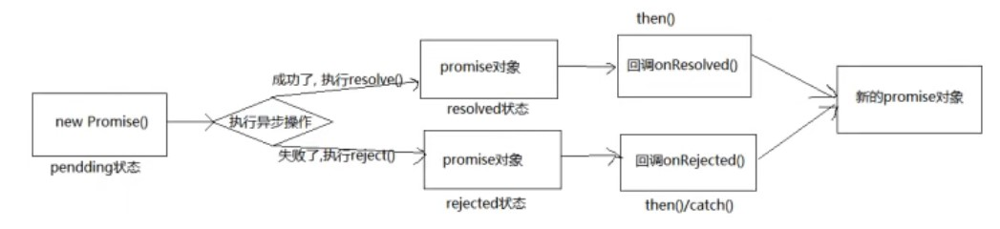

# 一、简介
promise是js中进行异步编程的**新解决方案**
旧方案是使用单纯的回调函数

promise可以使回调函数的方式更加灵活
promise：启动异步任务 => 返回promise对象 => 给promise对象绑定回调函数（甚至可以在异步任务结束后指定/多个）

**promise支持链式调用，可以解决回调地狱问题**
1. 什么是回调地狱？
回调函数嵌套调用，外部回调函数异步执行的结果是嵌套的回调执行的条件
2. 回调地狱的缺点？
不便于阅读，不便于异常处理
3. 解决方案：
promise链式调用

# 二、promise使用
## 2.1 promise基本使用
```js
            // promise 形式实现
            // resolve 和reject都是函数类型的数据
            // resolve代表解决时实现的函数
            // reject代表拒绝时实现的函数

            // promise 可以传递参数
            const p = new Promise((resolve, reject) => {
                setTimeout(() =>{
                    let n = rand(1,100);
                    if(n <= 30){
                        resolve(n); //将promise对象的状态设置为成功
                    }else{
                        reject(n); //将promise对象的状态设置为失败
                    }
                },1000);
            });

            // then函数，前面是resolve的解决方案，后面是reject的解决方案
            p.then((value) =>{
                alert('congratulation' + value);
            },
            (reason) =>{
                alert('try again' + reason);
            });
```
promise基本部分由两部分组成，第一部分为定义部分：
`const p = new Promise((resolve, reject) =>{});`
其中包括resolve和reject两部分，这两部分表示的都是函数。
resolve表示的是设置为成功时执行的函数；
reject表示的是设置为失败时执行的函数。

其中resolve和reject都能够传递参数。

第二部分为执行部分，也就是定义resolve函数和reject函数分别代表着什么含义。
第一部分传递的参数传递到第二部分可以分别进行定义，正如上面的n传递到resolve中代表的是value；传递到reject中代表的是reason。
```js
p.then(
    (value) =>{},    //第一个回调函数代表的是resolve函数
    (reason) =>{}    //第二个回调函数代表的是reject函数
);
```
## 2.2 promise的状态改变
promise中的属性（promiseState）：
- pending  未决定的
- resolved/fullfilled  成功
- rejected  失败
这个状态一个promise对象只能改变一次，并且只能够是`pending --> resolved`，或者是`pending --> rejected`。
无论变为成功还是失败，都会有一个结果数据
成功的结果数据一般称为value，失败的结果数据一般称为reason

promise中的另一个属性（promiseResult）保存着异步任务成功或失败的结果

也就是resolve或者是reject的值

## 2.3 promise的工作流程


## 2.4 promise的API
promise的构造函数：promise(executor){}
- executor函数：执行器`(resolve, reject)=>{}`
- resolve函数：内部定义成功时调用的函数 value =>{}
- reject函数：内部定义失败时调用的函数 reason =>{}
- executor会在promise内部立即**同步调用**，**异步操作**在**执行器**中执行

`promise.then(onResolve,onReject)=>{}`表示可以指定成功和失败的回调函数
`promise.catch(onReject)=>{}`其只能表示失败的回调函数

`promise.resolve()`中如果传入的参数为 非 Promise类型的对象，则返回的结果为成功promise对象
如果传入的参数为 Promise对象，则参数的结果决定了resolve的结果
```js
let p1 = Promise.resolve(xxx);
console.log(p1); //输出的值为xxx

let p2 = Promise.resolve(new Promise((resolve, reject) =>{
    reject('error');
}));

console.log(p2); //输出的值为error，类型为rejected
// 但是如果promise对象里是resolve('ok'),那么输出的值就是ok，类型为resolved
```

`promise.reject()`用于传出reason信息，也就是不管里面是什么，**输出类型都是rejected**。

`promise.all([])`中包含n个promise的数组，其会返回一个新的promise，只有所有的promise都成功才成功，只要有一个失败了就直接失败

```js
let p1 = new Promise((resolve, reject) => {
    resolve('ok');
})

let p2 = Promise.resolve('success');

let p3 = Promise.resolve('oh yeah');

let p4 = Promise.reject('err');

const result = Promise.all([p1,p2,p3]);  //result状态为resolved，值为p1,p2,p3的值

const result = Promise.all([p1,p2,p3,p4]);  //result状态为rejected，值为p4的值，因为他是err
```

`promise.race()`其也是包含n个promise的数组，其会返回一个新的promise。这一堆promise数组里谁先改变状态，谁就先输出。
**所以说这是一个赛跑问题，跑的最快的先出来**

## 2.5 promise的关键问题

### 2.5.1 改变promise对象状态的方式
1. resolve函数，`resolve('ok');`    pending => resolved
2. reject函数：`reject('error');`   pending => rejected
3. 抛出错误：`throw 'error';`       pending => rejected

### 2.5.2 promise指定多个回调
```js
let p = new Promise((resolve, reject) => {
    resolve('ok');
})

p.then(value =>{
    console.log(value);
})

p.then(value =>{
    alert(value);
})

// 两个回调都会进行
```
为一个promise指定多个回调时，当promise改变为对应状态是都会调用

### 2.5.3 改变promise状态和指定回调函数谁先谁后
```js
let p = new Promise((resolve, reject) => {
    resolve('ok');
})

p.then(value =>{
    console.log(value);
},reason =>{

})
```
当执行器函数中是一个同步任务时，先改变resolve的状态，再执行then中的函数
或者执行器函数中有一个延迟时间，但是then中延迟时间更长，则也会先改变resolve的状态，再执行函数

当执行器函数中是一个异步任务时，也就是需要等待一段时间的时候，先执行then中的函数，再改变状态

### 2.5.4 promise.then()中返回的新的promise的结果状态由什么决定

**由then()指定的回调函数执行的结果决定**

如果抛出异常，新promise变为rejected，reason为抛出的异常
如果返回的是非promise的任意值，新promise变为resolved，value为返回的值
如果返回的是另一个新promise，此promise的结果就会变成新promise的结果

### 2.5.5 promise串联多个操作任务
通过then方法可以链式调用多个任务
```js
let p = new Promise((resolve, reject) =>{
    setTimeout(() =>{
        resolve('ok');
    }, 1000);
});

p.then(value =>{
    return new Promise((resolve, reject) => {
        resolve('success');
    }).then(value => {
        console.log(value);   //输出success，因为这个里面的没有返回值结果，所以说这个undefined的返回值传到下一个里面输出的就是undefined
    }).then(value => {
        console.log(value);   //输出undefined
    })
});
```

### 2.5.6 promise异常穿透
```js
let p = new Promise((resolve, reject) =>{
    setTimeout(() =>{
        resolve('ok');
    }, 1000);
});

p.then(value => {
    throw 'error!';   //比如说我们这里抛出了一个异常，但是会在最后进行处理
    }).then(value => {
        console.log(222);
    }).then(value => {
        console.log(233);
    }).then(value => {
        console.log(344);
    }).catch(reason => {
        console.warn(reason);   //也就是这里来进行异常处理，这就叫做异常穿透
    })
```

当使用promise的then链式调用时，可以在最后指定失败的回调。
前面任何操作出了异常，都会传到最后失败的回调中处理

### 2.5.7 中断promise链

在回调函数中返回一个pending状态的promise对象，就能够中断链式调用。

```js
let p = new Promise((resolve, reject) =>{
    setTimeout(() =>{
        resolve('ok');
    }, 1000);
});

p.then(value => {
    console.log(111);
    return new Promise(() => {});  //这里是空的。返回pending，所以最后只显示111，后面就被忽略了。  
    }).then(value => {
        console.log(222);
    }).then(value => {
        console.log(233);
    };